Font Licneses
---

| Font Full Name (Kor) | Font Full Name (Eng) | File Name | License | Example |
|---|---|---|---|---|
| [나눔고딕](https://hangeul.naver.com/2021/fonts/nanum) | Nanum Gothic | NanumGothic.ttf | [license](https://hangeul.naver.com/2021/fonts) | 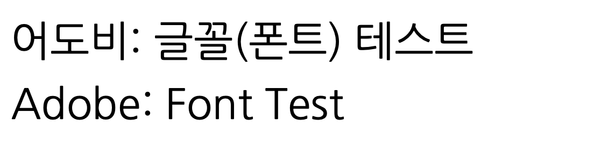 | 
| [나눔명조](https://hangeul.naver.com/2021/fonts/nanum) | Nanum Myeongjo | NanumMyeongjo.ttf | [license](https://hangeul.naver.com/2021/fonts) |  |
| [나눔바른고딕](https://hangeul.naver.com/2021/fonts/nanum) | Nanum Barun Gothic | NanumBarunGothic.ttf | [license](https://hangeul.naver.com/2021/fonts) |  |

| [솔뫼 김대건체 Medium](https://www.kimdaegeon.com/_ENG/node/?menu=n0501500) | SolMoe Kim Dae-gun Medium | solmoe-kimdaegeon-medium.ttf | 솔뫼 김대건체,써밋디자인,공유마당,CC BY | 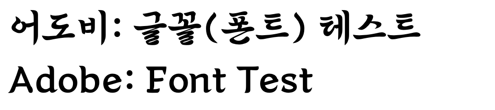 |
| [솔뫼 김대건체 Light](https://www.kimdaegeon.com/_ENG/node/?menu=n0501500) | SolMoe Kim Dae-gun Light | solmoe-kimdaegeon-light.ttf | 솔뫼 김대건체,써밋디자인,공유마당,CC BY | 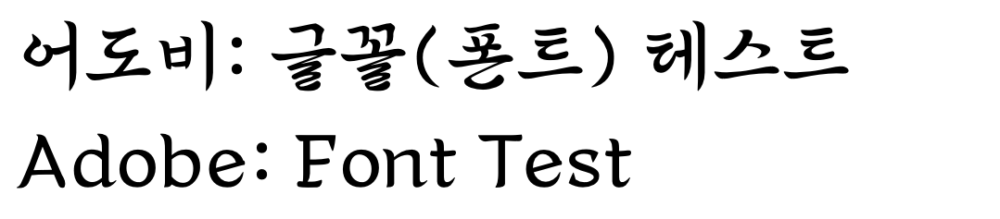 |
| [창원단감아삭체 Bold](https://www.changwon.go.kr/depart/contents.do?mId=1006160000) | Changwon Dangam Asac Bold | ChangwonDangamAsac-Bold.ttf | 무료글꼴, 창원 농업기술센터, 창원단감아삭체 |  |
| [문화재돌봄체 Bold](https://chdolbom.org/wp/%EB%B0%9C%EA%B0%84%EB%AC%BC/?uid=759&mod=document&pageid=1) | Chdolbom Bold | chdolbom-Bold.ttf | 본 저작물은 문화재청에서 2021년 작성하여 공공누리 제1유형으로 개방한 문화재돌봄체를 이용하였으며, 해당 저작물은 [문화재청](https://www.cha.go.kr/)에서 무료로 다운받으실 수 있습니다. | 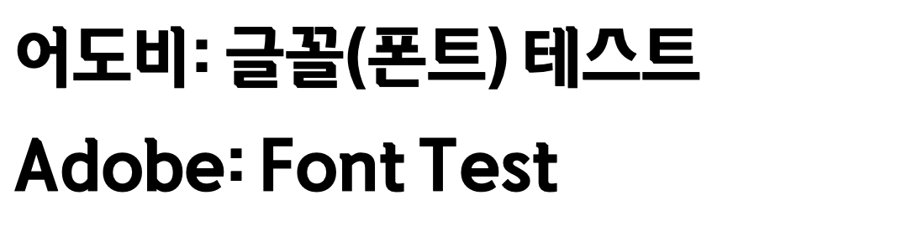 |
| [문화재돌봄체 Regular](https://chdolbom.org/wp/%EB%B0%9C%EA%B0%84%EB%AC%BC/?uid=759&mod=document&pageid=1) | Chdolbom Regular | chdolbom-Regular.ttf | 본 저작물은 문화재청에서 2021년 작성하여 공공누리 제1유형으로 개방한 문화재돌봄체를 이용하였으며, 해당 저작물은 [문화재청](https://www.cha.go.kr/)에서 무료로 다운받으실 수 있습니다. |  |
| [티웨이 하늘체](https://www.twayair.com/app/serviceInfo/contents/1320#none) | tway sky | tway_sky.ttf | t'way Air (All licenses are permitted except OFL.) | 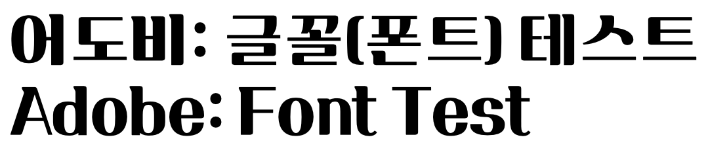 | 
| [박물관문화재단클래식 Bold](https://www.cfnmk.or.kr/agency/sub/20181024100034469100_contents.do) | CFNMK Classic Bold | CFNMK-classic-bold.ttf | Cultural Foundation of National Museum of Korea (All licenses are permitted except OFL.) | 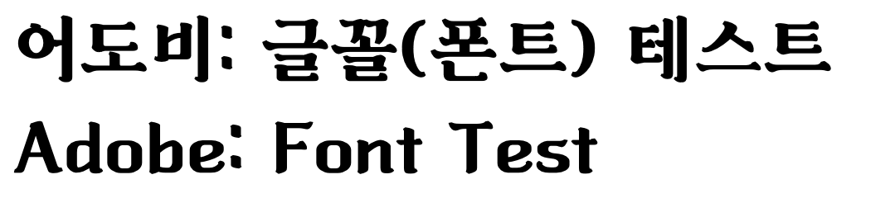 | 
| [박물관문화재단클래식 Light](https://www.cfnmk.or.kr/agency/sub/20181024100034469100_contents.do) | CFNMK Classic Light | CFNMK-classic-light.ttf | Cultural Foundation of National Museum of Korea (All licenses are permitted except OFL.) | 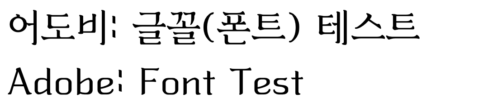 | 
| [박물관문화재단클래식 Medium](https://www.cfnmk.or.kr/agency/sub/20181024100034469100_contents.do) | CFNMK Classic Medium | CFNMK-classic-medium.ttf | Cultural Foundation of National Museum of Korea (All licenses are permitted except OFL.) | 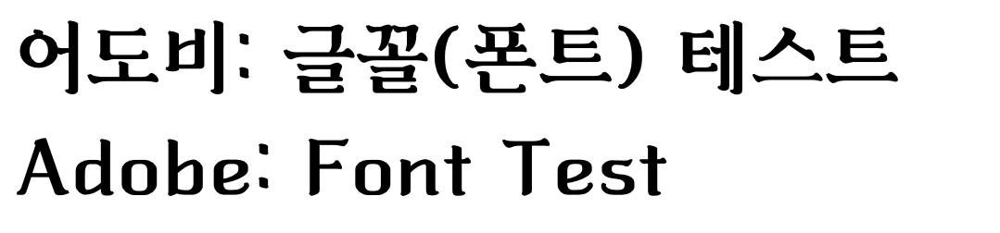 | 
| [함박눈체](https://blog.naver.com/snowfrost001/221708816790) | Hambaknoon | hambaknoon.ttf | snowfrost001 ([All licenses are permitted except OFL.](https://blog.naver.com/snowfrost001/222287054506)) | 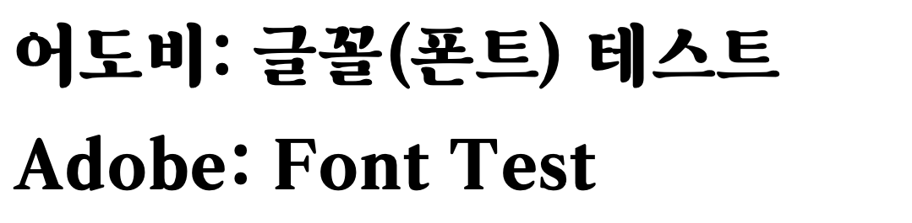 | 
| [HS새마을체](https://blog.naver.com/hp0/222417104986) | HSSaemaul | HSSaemaul.ttf | 토끼네활자공장 (All licenses are permitted except OFL.) | 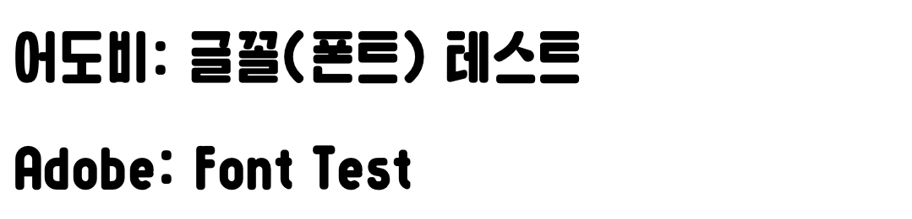 | 
| [HS겨울눈꽃체](https://blog.naver.com/hp0/222417104986) | HSGyoulnoonkot | HSGyoulnoonkot.ttf | 토끼네활자공장 (All licenses are permitted except OFL.) | 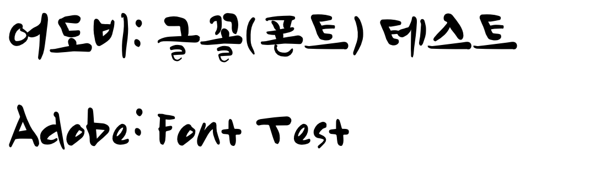 | 
| [116수박화체](https://blog.naver.com/wosr1/221324032660) | 116Watermelon | 116watermelon.ttf | DESyell (All licenses are permitted except OFL.) | 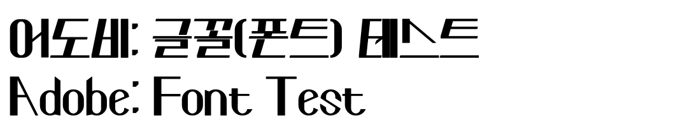 |
| [109다람쥐꼬리](https://blog.naver.com/wosr1/221672263551) | 109squirrel tail | 109squirrel_tail.ttf | DESyell (All licenses are permitted except OFL.) |  |
| [제주한라산체](https://www.jeju.go.kr/jeju/symbol/font/infor.htm) | JejuHallasan | JejuHallasan.ttf | 본 저작물은 제주특별자치도에서 작성하여 공공누리 제1유형으로 개방한 제주한라산체를 이용하였으며, 해당 저작물은 [제주특별자치도](https://www.jeju.go.kr/jeju/symbol/font/infor.htm)에서 무료로 다운받으실 수 있습니다. |  |
| [넥슨풋볼고딕 Light](http://levelup.nexon.com/font/index.aspx?page=4) | Nexon FootBall Gothic Light | NEXONFOOTBALLGOTHICL.ttf | NEXON (All licenses are permitted except OFL.) |  |
| [넥슨풋볼고딕 Bold](http://levelup.nexon.com/font/index.aspx?page=4) | Nexon FootBall Gothic Bold | NEXONFOOTBALLGOTHICB.ttf | NEXON (All licenses are permitted except OFL.) |  |
| [양평군체 Bold](https://www.yp21.go.kr/www/contents.do?key=2620) | YangPyeong Bold | yangpyeong_B.ttf | 본 저작물은 양평군에서 작성하여 공공누리 제1유형으로 개방한 제주한라산체를 이용하였으며, 해당 저작물은 [양평군](https://www.yp21.go.kr/www/contents.do?key=2620)에서 무료로 다운받으실 수 있습니다. | 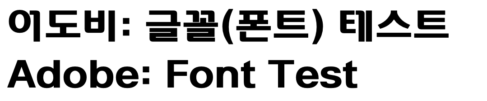 | 
| [양평군체 Light](https://www.yp21.go.kr/www/contents.do?key=2620) | YangPyeong Light | yangpyeong_L.ttf | 본 저작물은 양평군에서 작성하여 공공누리 제1유형으로 개방한 제주한라산체를 이용하였으며, 해당 저작물은 [양평군](https://www.yp21.go.kr/www/contents.do?key=2620)에서 무료로 다운받으실 수 있습니다. | 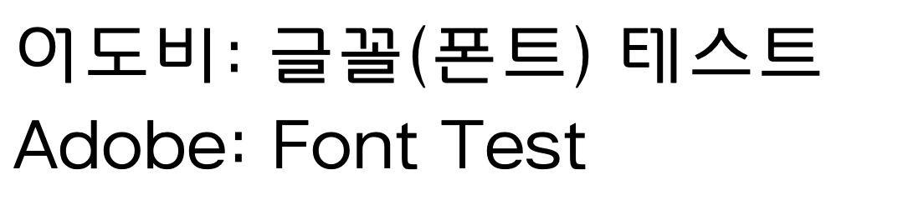 | 
| [양평군체 Medium](https://www.yp21.go.kr/www/contents.do?key=2620) | YangPyeong Medium | yangpyeong_M.ttf | 본 저작물은 양평군에서 작성하여 공공누리 제1유형으로 개방한 제주한라산체를 이용하였으며, 해당 저작물은 [양평군](https://www.yp21.go.kr/www/contents.do?key=2620)에서 무료로 다운받으실 수 있습니다. | 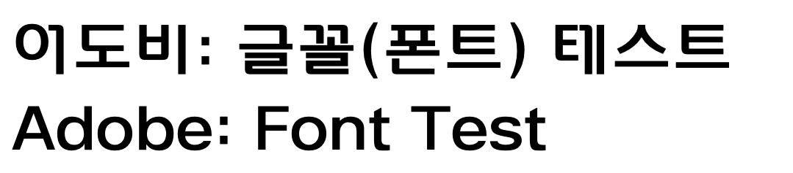 | 
| [ON월인석보 Bold](https://www.oning.co.kr/ONWorinseokbo) | ONWorinseokbo Bold | ONWorinseokbo-B.ttf | [license](https://www.oning.co.kr/license) | 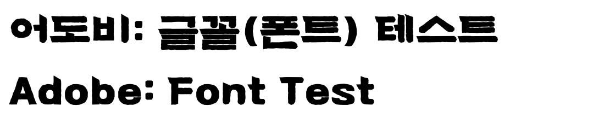 |
| [ON월인석보 Light](https://www.oning.co.kr/ONWorinseokbo) | ONWorinseokbo Light | ONWorinseokbo-L.ttf | [license](https://www.oning.co.kr/license) | 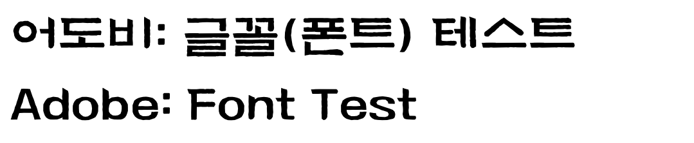 |
| [ON월인석보 Regular](https://www.oning.co.kr/ONWorinseokbo) | ONWorinseokbo Regular | ONWorinseokbo-R.ttf | [license](https://www.oning.co.kr/license) |  | 
